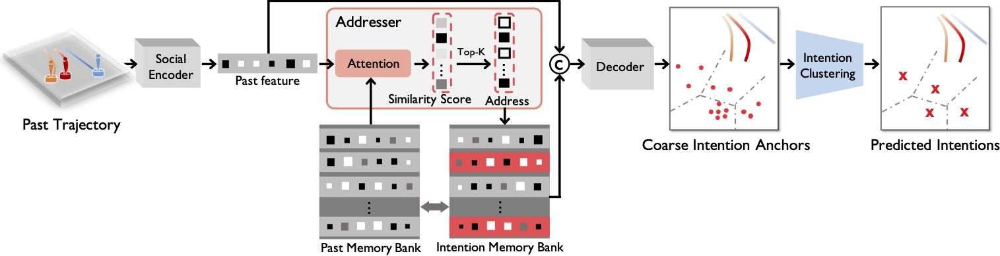
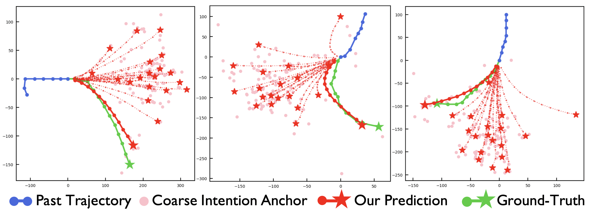
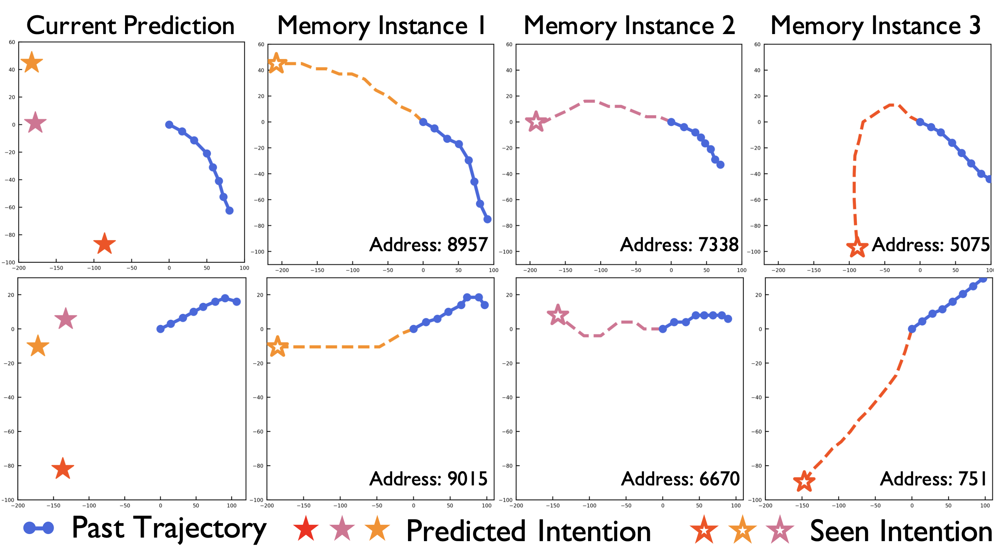

# Remember Intentions: Retrospective-Memory-based Trajectory Prediction

**Official PyTorch code** for "Remember Intentions: Retrospective-Memory-based Trajectory Prediction".



**Abstract**: To realize trajectory prediction, most previous methods adopt the parameter-based approach, which encodes all the seen past-future instance pairs into model parameters. However, in this way, the model parameters come from all seen instances, which means a huge amount of irrelevant seen instances might also involve in predicting the current situation, disturbing the performance. To provide a more explicit link between the current situation and the seen instances, we imitate the mechanism of retrospective memory in neuropsychology and propose MemoNet, an instance-based approach that predicts the movement intentions of agents by looking for similar scenarios in the training data. In MemoNet, we design a pair of memory banks to explicitly store representative instances in the training set, acting as prefrontal cortex in the neural system, and a trainable memory addresser to adaptively search a current situation with similar instances in the memory bank, acting like basal ganglia. During prediction, MemoNet recalls previous memory by using the memory addresser to index related instances in the memory bank. We further propose a two-step trajectory prediction system, where the first step is to leverage MemoNet to predict the destination and the second step is to fulfill the whole trajectory according to the predicted destinations. Experiments show that the proposed MemoNet improves the FDE by 20.3\%/10.2\%/28.3\% from the previous best method on SDD/ETH-UCY/NBA datasets. Experiments also show that our MemoNet has the ability to trace back to specific instances during prediction, promoting more interpretability.


We give an example of trajectories predicted by our model and the corresponding ground truth as following:



Below is an example of prediction interpretability where the first column stands for the current agent. The last three columns stand for the memory instances found by the current agent.



## Installation

### Environment

* Tested OS: Linux / RTX 3090
* Python == 3.7.9
* PyTorch == 1.7.1+cu110

### Dependencies

Install the dependencies from the `requirements.txt`:
```linux
pip install -r requirements.txt
```

### Pretrained Models

We provide a complete set of pre-trained models including:

* intention encoder-decoder:
* learnable addresser:
* generated memory bank:
* fulfillment encoder-decoder:

You can download the pretrained models/data from [here](https://drive.google.com/drive/folders/1qx5vbNgyM9aMH9jB_F07w3QIxzzi6StW?usp=sharing).

## Training

* `--info`: path name to store the models
* `--gpu`: number of devices to run the codes

### Step-1: Train the intention encoder-decoder

```linux
python Step_1_train_intention_encdec.py --info train_intention_encdec_try1 --gpu 0
```

### Step-2: Warm up the learnable addresser


```linux
python Step_2_selector_warm_up.py --info train_addresser_warm_up_try1 --gpu 0
```

### Step-3: Finetune the learbale addresser

```linux
python Step_3_selector_finetune.py --info train_addresser_finetune_try1 --gpu 0
```

### Step-4: Train the fulfillment encoder-decoder

```linux
python Step_4_train_trajectory.py --info train_trajectory_try1 --gpu 0
```

## Testing

### Test-1: Test the intention encoder-decoder

```linux
python Test_1_encdec_write_all --info test_intention --gpu 0
```

### Test-2: Test the learnable addresser

```linux
python Test_2_addresser.py --info test_addresser --gpu 0
```

### Test-3: Test the fulfillment encoder-decoder

```linux
python Test_3_trajectory.py --info test_trajectory --gpu 0
```


## Reproduce

To get the reported results, following

```linux
python Test_3_trajectory.py --reproduce True --info debug --gpu 1
```

And the code will output: 

```linux
./training/training_trajectory/model_encdec_trajectory
Test FDE_48s: 12.659514427185059 ------ Test ADE: 8.563031196594238
----------------------------------------------------------------------------------------------------
```


## Acknowledgement

Thanks for the framework provided by `Marchetz/MANTRA-CVPR20`, which is source code of the published work MANTRA in CVPR-2020. The github repo is [MANTRA code](https://github.com/Marchetz/MANTRA-CVPR20). We borrow the framework and interface from the code.

We also thank for the pre-processed data provided by the works of PECNet ([paper](https://link.springer.com/chapter/10.1007%2F978-3-030-58536-5_45),[code](https://github.com/j2k0618/PECNet_nuScenes)).

## Citation

If you use this code, please cite our paper:

```
@InProceedings{MemoNet_2022_CVPR,
author = {Xu, Chenxin and Mao, Weibo and Zhang, Wenjun and Chen, Siheng},
title = {Remember Intentions: Retrospective-Memory-based Trajectory Prediction},
booktitle = {The IEEE/CVF Conference on Computer Vision and Pattern Recognition (CVPR)},
year = {2022}
}
```
